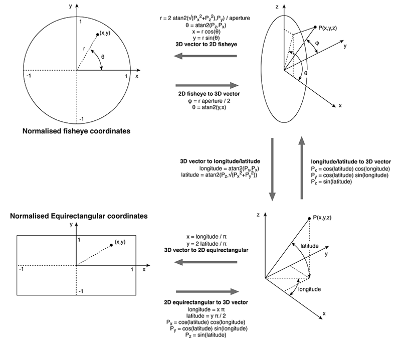
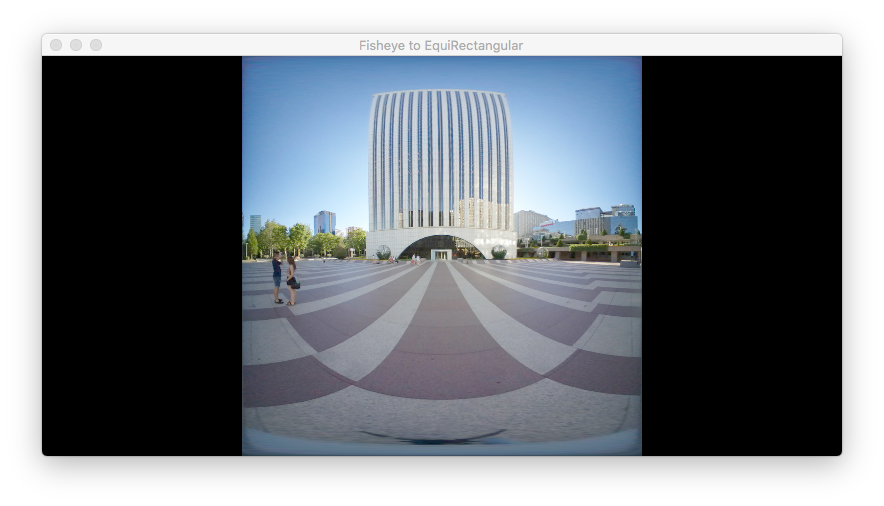
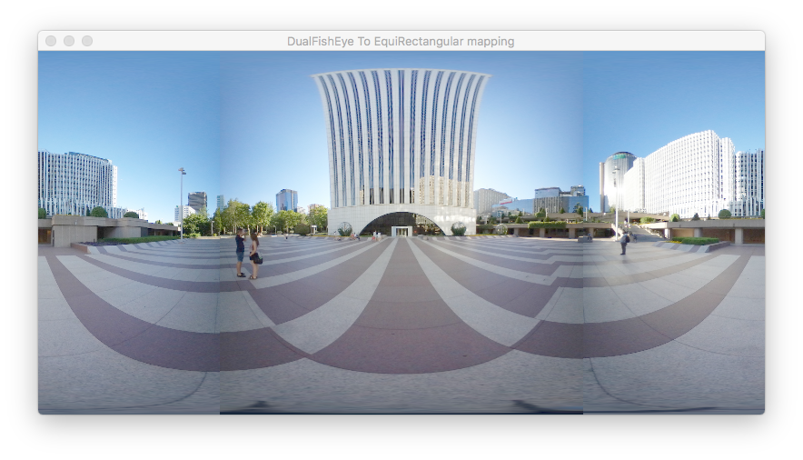

## Convert a Single FishEye image to render a Skybox


This project attempts to project a single fisheye image as skybox.

This demo assumes the single fisheye image is a square, centered and it fills the entire inscribed circle. 

Note: The original fragment shader code was posted at weblink 1).

To compare the code in the fragment shader  (fisheye2skybox.fs) with that listed in the diagram below (which is posted at weblink 2):



The line of code:

```glsl
    float r = 2.0 * atan(length(n.xy), abs(n.z)) / PI;
```

is equivalent to the lines

    float phi = atan(length(n.xy), abs(n.z));
    float r = 2.0 * phi / PI;

where the aperture (FOV) is taken to have a  value of π which might not be the case in a real fisheye camera lens.

And the line

```glsl

    vec2 uv = vec2(cos(theta), sin(theta)) * r * 0.5 + vec2(0.5);
```
can be re-written as:

```glsl

    float u = r * cos(theta);
    float v = r * sin(theta);

    vec2 uv = vec2(u, v) * 0.5 + vec2(0.5);
```

it is obvious the diagram's code should serve only as a guide. In fact, the concept proposed by the article can be applied to images produced by both single and dual fisheye lens. Given below are the equirectangular projecions of 2 images. The first is projected from an image taken with a single fisheye lens while the second is from a dual fisheye image.







Note: A single fisheye image can not be used to project a 360 degree view of the environment. A dual fisheye image is required. However, to produce a correctly aligned EquiRectangular Projection (ERP), proper stitching is required.


<br />
<br />
<br />


Weblinks:

1) https://stackoverflow.com/questions/60819068/fisheye-skybox-shader

2) http://paulbourke.net/dome/dualfish2sphere/

    "Converting dual fisheye images into a spherical (equirectangular) projection"

3) http://paulbourke.net/dome/fish2/

    "Converting a fisheye image into a panoramic, spherical or perspective projection"


4) http://paulbourke.net/dome/fisheye/

    "Computer Generated Angular Fisheye Projections"

5) https://blog.kuula.co/fisheye-equirectangular

    "https://blog.kuula.co/fisheye-equirectangular"

<br />
<br />
<br />


**Requirements:**

Compiled with XCode 8.3.2 running under macOS 10.12 (Sierra)

Tested with:

a) iOS OpenGL 3.0
b) macOS OpenGL Core Profile.
